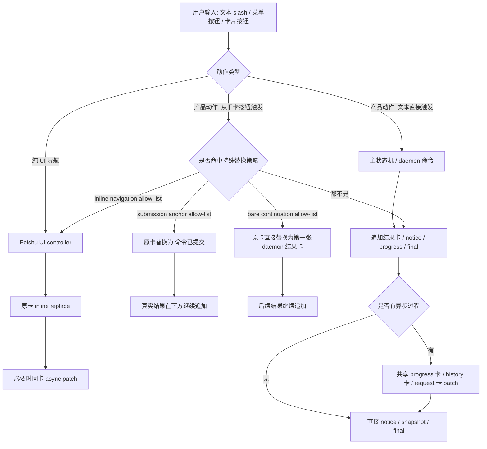

# 飞书菜单 / Slash Command 卡片工作流审计（讨论草稿）

> Type: `draft`
> Updated: `2026-04-18`
> Summary: 审计当前飞书菜单、slash command、picker、request、progress、final reply 等卡片链路的实际交互模型；通用原则已提炼到 `docs/general/feishu-business-card-interaction-principles.md`，picker 业务流的具体重构已转入 GitHub issue #262。

## 0. 当前定位

这份草稿现在主要保留两类内容：

1. 对现状交互的审计与问题归纳
2. 作为 `picker` 业务流案例的讨论底稿

已经从这份草稿中稳定抽出的内容：

- 通用卡片设计原则：`docs/general/feishu-business-card-interaction-principles.md`
- picker 业务流后续跟踪：GitHub issue `#262`

因此后面如果要继续推进实现，应优先以正式原则文档和 issue 为准，而不是继续把所有结论堆回这份草稿。

## 1. 这份草稿要解决什么问题

这次不是看单个 bug，也不是给某个按钮补逻辑，而是要回答两个更大的产品问题：

1. 现在所有菜单命令 / slash command 卡片，整体上到底是怎么流转的。
2. 如果按更合理的“卡片式向导”思路重做，交互边界应该怎么划。

当前代码已经不是“只有一种卡片交互模型”，而是至少混用了下面 5 套：

1. 原卡 inline replace
2. 原卡 loading -> async patch
3. 原卡被替换成“命令已提交”，真正结果在下方新卡
4. 原卡直接保留，结果另起新卡
5. 原卡被直接替换成某个 daemon 产出的首张结果卡（`/debug` / `/upgrade` 的特殊 continuation）

这 5 套本身并不一定都错，但它们现在没有一条稳定、可预测的用户规则，所以用户很难知道：

- 我点完这个按钮，接下来应该盯着哪张卡？
- 这张卡是还活着，还是其实已经半死不活，只是等过期？
- 这是同一个步骤内的刷新，还是已经进入下一阶段？

我的结论先写在前面：

- 当前最大的问题，不是某一张卡不好看，而是“卡片职责层次不稳定”。
- 当前最容易让人困惑的，不是 picker 本身，而是“从入口卡跳入具体业务流之后，当前到底哪张卡还拥有这条业务流”不明确。
- 如果按卡片 UI 的天性来设计，这套产品更适合做成“单一业务默认一张 owner card 走到底”的模型，而不是“选完入口以后，后续状态分散到好几张卡”。
- 但也不能简单地把所有事情都塞回同一页，因为另一个同样严重的问题是：部分卡片一次性承载了太多决策点，用户会在同一张卡里被迫同时关注‘我要做什么、我现在在哪、我下一步去哪、这卡还能不能点’。
- 所以后续设计目标不应是‘每一步都发新卡’，也不应是‘一张页面承载所有问题’，而应该是‘一条业务流默认由一张 owner card 走到结束；同一页只回答一个主问题；高频联动保留同页，重分支和重表单拆成 owner card 内部的下一步页面’。

## 2. 这次新增的审计维度：不是只有 patch / 新卡，还要看信息密度

上一版更多是在看‘这张卡之后是 patch 还是 append’，但现在看下来，只用这个维度还不够。

因为有些卡的问题不是生命周期，而是它即使生命周期完全清晰，也仍然会让人累：

- 一张卡里同时出现太多可操作区域
- 一张卡里同时出现太多层级不同的决策
- 主任务和辅助信息混在一起，用户不知道先看哪里
- 有些内容其实是下一阶段才需要关心，却过早出现在当前卡里

所以这次我补了 3 个一起看的判断轴：

1. 生命周期清晰度
   - 这张卡结束后，用户能不能一眼知道它是否还能点。
2. 主关注点数量
   - 这张卡上，用户此刻到底需要做几个不同层级的决定。
3. 高频来回成本
   - 这个步骤是不是用户会频繁切来切去；如果会，那过度拆卡反而会变差。

后面所有结论，都会同时看这 3 个轴，而不再只看‘是不是单卡’。

## 3. 我现在更认同的一条总原则

不是“一张卡做完整个流程”，也不是“每个动作都拆成一步一张新卡”，而是：

**单一业务流默认由一张 owner card 走到底；owner card 内部再按页面回答不同主问题。**

这句话展开以后是：

- 如果用户还在等待这条业务流的结果、还可能取消、还需要看进度或输出，那么它就不应脱离当前 owner card。
- 但同一张 owner card 内部，也不能把所有问题都堆在同一页上。
- 所以“是否拆页”的判断，不是看功能模块，而是看用户此刻的主问题有没有变化。

进一步说：后面判断一页是不是过载，不要只数控件数量，而要数“主问题数量”。

- 如果多个控件其实都在帮助用户回答同一个问题，那可以同页。
- 如果同一页开始同时要求用户回答两个不同阶段的问题，那就该拆成 owner card 内部的下一步页面。

用当前 picker 的例子来说：

- `已有工作区 -> 选工作区 -> 选会话` 经常是联动比较、反复切换的，所以保留在 owner card 的同一页里是合理的。
- 但 `新建工作区 -> 选择来源 -> 选择本地目录 / 配 Git URL` 已经是在回答另一个问题，就不应继续和“已有工作区/会话选择”并列堆在同一页。

## 4. 现状里的 5 种卡片行为

先把现状抽象成 5 种可复用的交互原语。后面所有命令，基本都落在这里的某一种或某几种组合里。

| 模型 | 当前典型场景 | 用户看到什么 | 当前主要问题 |
| --- | --- | --- | --- |
| A. 原卡 inline replace | `/menu` 组间切换、target picker 下拉切换、path picker 浏览、history 页内跳转 | 原来的卡在原位变成新的内容 | 适合局部导航，本身问题不大 |
| B. 原卡 loading -> async patch | `/history`、共享 process 卡 | 先看到 loading 或处理中，后续同卡刷新 | 这是目前最接近“单任务单卡”的一类 |
| C. 提交锚点替换 + 真实结果新卡追加 | 从菜单卡里点 `/list` `/use` `/new` `/status` `/stop` `/detach` `/cron` 等 | 原卡先变成“命令已提交”，真正操作卡或结果卡出现在下面 | 注意力最容易断裂；用户直觉还停在旧卡位置 |
| D. 原卡保留，结果另起新卡 | 许多参数应用动作、notice、普通 slash 命令文本触发 | 原卡还在，上面没明确收口，下面多一张新卡 | 容易留下半活卡，用户不确定能否继续点 |
| E. 原卡直接替换成首张结果卡 | 从卡内触发 bare `/debug`、bare `/upgrade` | 不是“已提交”锚点，而是直接替成 daemon 生成的第一张卡 | 又是另一套例外规则，用户难以预测 |

这 5 种里，A/B 是比较健康的；真正造成整体体验零散的，是 C/D/E 混在一起。

## 5. 当前总图：从入口到结果，实际怎么走

下面这个图是把现在主要路径抽象出来，而不是逐函数展开。

如果只看工程实现，这个图没问题；但如果从用户体验看，问题非常明显：

- 同样是“在卡片里点一个按钮”，后续可能走 4 种不同的视觉规则。
- 用户无法凭经验预测，自己该继续盯着原卡、下方新卡、还是处理中卡。

## 6. 逐类流程审计

## 6.1 `/menu` 与帮助 / 配置卡

### 当前实际流程

#### `/menu`

- 文本输入 `/menu`
  - 打开一张“命令菜单”卡。
  - 首页只负责分组导航。
- 在菜单卡里点某个分组
  - 同卡 inline replace 到分组页。
- 在分组页点“返回上一层”
  - 同卡 inline replace 回首页。
- 在分组页点具体命令
  - 不是统一行为：后续取决于那个命令属于哪一类。

#### `/help`

- 文本输入 `/help`
  - 直接 append 一张静态帮助卡。
- normal mode 下，`/list` 已被产品定义为“选择工作区/会话”；`/use` / `/useall` 在帮助展示里已折叠掉。
- vscode mode 下，`/list` / `/use` / `/useall` 仍分别展示。

#### bare 配置命令：`/mode` `/autowhip` `/reasoning` `/access` `/model` `/verbose`

- 文本输入 bare slash（例如 `/reasoning`）
  - 打开对应配置卡。
- 如果这个 bare slash 是从旧卡按钮点出来的
  - 当前实现通常会用 inline replace，把旧卡换成配置卡。
- 在配置卡里点击具体选项（例如 `/reasoning high`）
  - 通常不会继续留在“这个配置步骤”里 patch 当前卡，而是 append 一张 notice 或结果卡。
  - 原配置卡本身通常不会同步变成“已应用后的终态卡”。

### 当前优点

- `/menu` 组间切换本身很顺。
- bare 配置卡的内容组织已经比较清楚。
- help 在 normal / vscode 两种模式下已经开始做产品定义收敛。

### 当前问题

1. `/menu` 只在“菜单内部导航”时像一个完整子流程；一旦点进具体命令，就开始掉进别的规则。
2. 配置卡“打开”是卡片流程，但“应用”往往又退化成追加 notice，导致这张配置卡没有明确收口。
3. 用户从 `/menu` 点进具体命令后，经常不知道自己是不是已经离开了菜单上下文。

### 结论

- `/menu` 现在更像“命令分发器”，还不是“稳定的向导入口”。
- 它的问题不在首页或分组切换，而在“从菜单进入具体命令后，没有统一 handoff 规则”。

## 6.2 normal mode 的 `/list` `/use` `/useall`：统一 target picker

### 当前实际流程

当前 normal mode 下，这三条已经合流到同一个 `FeishuTargetPickerView`。

#### 入口

- 文本 `/list`
  - 直接 append 一张 target picker 卡。
- 文本 `/use` / `/useall`
  - 同样 append target picker 卡，但标题和默认来源略有区别。
- 从菜单卡里点 `/list`
  - 原菜单卡先被替换成“命令已提交”。
  - 真正的 target picker 卡会另外 append 到下面。

#### 卡内子步骤

在 target picker 卡内：

- 切换“已有工作区 / 添加工作区”
  - inline replace，同卡刷新。
- 选 workspace
  - inline replace，同卡刷新。
- 选 session
  - inline replace，同卡刷新。
- 添加工作区模式下，切换“本地目录 / Git URL”
  - inline replace，同卡刷新。
- 选择 path picker 子步骤
  - 当前主卡被 inline replace 成 path picker 子卡。
- path picker 内继续浏览目录
  - inline replace，同卡刷新。
- path picker confirm / cancel
  - 返回主卡，并 inline replace 成回填后的 target picker 卡。

#### 最终确认

- 选择已有 workspace + 现有 session
  - 触发 attach / use 逻辑。
  - 成功后清掉 active picker。
  - 但用户视觉上通常看到的是：旧 target picker 卡不再更新，结果在下方新卡 / notice / 后续状态里体现。
- 选择已有 workspace + 新建会话
  - 进入 `/new` 等价的新会话待命语义。
  - 也是下方继续出结果。
- 添加工作区 / 本地目录 confirm
  - 直接进入接入 + 新会话待命。
  - 同样是结果另行追加。
- 添加工作区 / Git URL confirm
  - 如果表单不完整：原卡 inline replace，自身显示错误。
  - 如果配置有效：当前会 append“正在导入 Git 工作区”的 notice，并下发 daemon 命令。
  - 这时原表单卡不会立即终态化。

### 当前优点

- target picker 内部的局部刷新其实已经相当统一。
- “工作区 / 会话 / 来源 / path picker 子步骤”都已经归到了同一个 read model 上，工程上是好的基础。
- path picker 作为子流程被复用，方向是对的。

### 当前主要问题

1. 入口来自菜单时，用户首先看到的是“命令已提交”，而真正要操作的是下面的新卡。
2. target picker 内部是一个完整子流程，但最终 confirm 后没有一个明确的“本步骤已结束”的终态卡。
3. Git URL 成功提交后，原表单卡还留在那儿，语义上像还可以继续编辑；这会让用户怀疑是否提交成功，也可能诱发重复点击。
4. “局部子任务做得很像向导，但真正离开这一步时却没有向导式收口”，这是它最别扭的地方。

### 结论

- target picker 本身已经非常接近正确模型。
- 它真正缺的是“阶段完成后的交接规则”，而不是更多 patch 逻辑。

## 6.3 `FeishuPathPickerView`：路径/文件选择子流程

### 当前实际流程

这个组件被至少两类场景复用：

1. `/sendfile`
2. target picker 的“本地目录 / Git 落地父目录”子步骤

#### 进入 picker

- 通过父流程打开。
- 当前会把父卡 inline replace 成 path picker 卡，或者直接 append 新 picker 卡（例如 `/sendfile`）。

#### picker 内部

- 进入子目录：inline replace
- `..` 返回上一级：inline replace
- 选择目录 / 文件：inline replace
- `.` 开头目录排在普通目录后，`..` 固定置顶

#### picker 结束

- confirm：交给 consumer
- cancel：交给 consumer

### `/sendfile` 当前问题尤其明显

`/sendfile` 打开的是一个文件 picker，这个 picker 内部浏览体验没问题，但 confirm / cancel 后：

- 真正发送动作或取消 notice 会出现在后续新消息里。
- 原 picker 卡本身不会变成明确的“已发送 / 已取消”终态。
- 因为 active picker 已清掉，所以旧卡是“视觉上还在、逻辑上已失效”的半死卡。

这不是严格意义上的死流程，但它对用户来说是“死感很强”的流程：

- 旧卡还在
- 但再点只会收到 expired / invalid
- 用户的注意力却还留在这张卡上

### 结论

- path picker 作为“局部浏览组件”本身没问题。
- 问题在于：它被当成子步骤时，返回主卡的处理还算顺；它被当成独立步骤时，完成态没有封口。

## 6.4 `/history`：当前最像“单任务单卡”的流程

### 当前实际流程

#### 入口

- 文本 `/history`
  - 直接 append 一张“历史记录”loading 卡。
- 如果从旧历史卡里翻页 / 进详情
  - 原卡 inline replace 成 loading 版本。

#### 异步读取

- daemon 发起 `thread.history.read`
- 结果回来后，patch 同一张 history 卡
  - 列表页 -> 详情页
  - 详情页 -> 其他 turn
  - 失败态 -> 同卡错误展示

### 当前优点

- 用户的注意力始终集中在同一张卡上。
- 这张卡从 loading、列表、详情到错误态，始终是“同一个任务对象”。
- 这类模式非常符合卡片式向导/查看器语义。

### 结论

- `/history` 是当前最值得保留为“参考样板”的交互之一。
- 后续统一设计时，可以把它作为“读型流程”的标准模型。

## 6.5 request / approval / `request_user_input` / `mcp_server_elicitation`

### 当前实际流程

这类卡目前已经自成体系：

- 请求来了，append 一张 request 卡。
- 题目选择、局部答案保存、未答确认态、confirm/cancel，都尽量在同卡内推进。
- `request_user_input`、`permissions_request_approval`、`mcp_server_elicitation` 都已经归入同一套 request 卡体系。

### 当前优点

- 它天然就是“一个任务一张卡”。
- 用户认知负担低：我就在这张卡里把事情做完。
- 题级暂存、已答/待答状态、未答确认等都属于合理的同卡状态机。

### 当前问题

- 主要不在 request 卡内部，而在 request 卡解决以后，后续业务流是否还会掉进别的规则。
- 如果 request 的后续动作进入“提交锚点替换 + 下方新卡继续”的体系，体验仍会被打断。

### 结论

- request 卡内部模型基本正确。
- 它应该被视为“阶段卡”的正面例子。

## 6.6 共享 progress 卡 / final reply

### 当前实际流程

#### 共享 progress 卡

- 当前用于 `exec_command` / `web_search` / `mcp_tool_call` / `dynamic_tool_call` / `context_compaction`
- 首次 append 到会话
- 后续 `message.patch` 同卡刷新
- `verbose` 时可见；`normal` 会隐藏 process detail；`quiet` 进一步压缩

#### final reply

- 主 final card append-only
- 超长内容再拆 overflow reply cards

### 当前优点

- 对“执行过程”这件事，已经有独立承载面。
- 这和菜单/picker/request 属于另一层语义，不应该混在一张卡里。

### 当前结论

- 共享 progress 卡 + final reply 这条大方向是对的。
- 真正要改的不是它，而是“前面的交互步骤如何交给它”。

## 6.7 daemon 命令卡：`/debug` `/upgrade` `/cron` `/status` 等

### 当前实际流程

这一组最容易出现“例外中的例外”。

#### `/status`

- 文本输入：直接 append snapshot 卡。
- 从菜单卡点：旧卡先变成“命令已提交”，真实 snapshot 卡在下面。

#### bare `/debug` / bare `/upgrade`

- 如果从旧卡按钮点出来，当前不是“命令已提交”锚点，而是会尝试把 daemon 产出的第一张卡直接作为 replacement card。
- 换句话说，它们走的是一套特殊 continuation 逻辑。

#### bare `/cron`

- 和 bare `/debug` / `/upgrade` 又不一样。
- 它目前更接近 submission anchor：旧卡先变“命令已提交”，后续真正卡片继续 append。

### 当前问题

- 对用户来说，这三个命令看起来都属于“低频维护类命令”。
- 但它们实际落地时，视觉规则却分成了至少三种。
- 这是当前最典型的“工程路径一致，产品交互不一致”。

### 结论

- 这类 daemon-owned 命令在现状里例外太多，后续必须统一成一套可预测的提交/执行规则。

## 7. 只看生命周期还不够：当前最容易让用户疑惑的 3 类问题

把上面的流程浓缩一下，当前问题其实分成 3 大类：生命周期不清、注意力断裂、单卡过载。

### 7.1 同样是“点一条命令”，后续却不是同一种视觉语义

用户无法建立稳定心智模型：

- 有的会原卡刷新
- 有的会原卡变“已提交”
- 有的直接下方出结果
- 有的还会把第一张 daemon 卡直接顶替上去

这会让用户每次都得重新判断“该盯哪儿看”。

### 7.2 “命令已提交”锚点卡是当前最大注意力断裂源

这张卡不是没有价值，但它在多数场景里抢走了原卡位置，却没有继续承载后续交互。

结果就是：

- 用户注意力被留在“已提交”卡
- 真正要继续操作的卡在下面
- 尤其 target picker、status、cron 这类都很明显

### 7.3 很多卡片没有明确终态，导致“半死卡”残留

典型如：

- `/sendfile` 的 picker 完成后
- 某些 config 卡应用后
- 某些选择卡 confirm 后
- Git import 已提交但原表单还活着

它们不是完全死流程，但会制造一种“这张卡是不是还能继续用”的不确定感。

### 7.4 局部浏览步骤和跨阶段业务步骤没有被明确区分

当前系统在代码层其实已经部分区分了：

- 局部浏览：path picker、history detail、menu group nav
- 产品语义：attach / use / new / debug / cron / upgrade

但在用户体验层，这个边界没有被直观呈现出来。

### 7.5 从入口卡跳到业务卡时，没有稳定的 handoff 规则

现在菜单卡、配置卡、target picker、path picker、daemon 结果卡之间，都是“各自想办法交接”。

缺少一个统一规则：

- 什么时候原卡该继续承担这个任务
- 什么时候它应该退场
- 什么时候应该把责任交给新卡

### 7.6 读型流程和写型流程没有用不同标准对待

- `/history`、request 这种读/填表型流程，更适合同卡完成。
- `/list` confirm、`/sendfile` confirm、`/upgrade` 执行这类带副作用的动作，更应该显式跨阶段。

当前它们没有被清楚地区分开来。

### 7.7 另一类同样严重的问题：单卡主关注点过多

这次重新看下来，我觉得 target picker 暴露得最明显。

它现在不是单纯‘这张卡后面怎么跳’的问题，而是单卡里同时塞了：

- 模式切换：已有工作区 / 添加工作区
- 现状摘要：当前工作区 / 当前会话
- 当前阶段的主输入：工作区 / 会话
- 添加工作区分支的来源切换：本地目录 / Git URL
- 本地目录分支的路径回填
- Git 分支的表单输入、目录选择、最终路径预览、校验信息
- 底部通用确认/取消

这会导致一个典型问题：

- 生命周期上它也许没错
- 但用户此刻不知道‘我现在最该关注哪个区域’

尤其 Git 分支，已经不只是‘继续完成当前阶段’，而是在同一张卡里嵌入了一个新的重表单子流程。

所以这里不能简单追求‘保持单卡’，而应该承认：

- 有些高频联动决策适合同卡
- 有些重分支决策一旦进入，就应该切到 owner card 的下一步页面

## 8. 我建议的统一设计逻辑

这里先给原则，不先落具体实现。

## 8.1 先把卡片角色分成 4 类

后续所有卡片都尽量只落在下面 4 类之一：

1. 菜单卡（Launcher Card）
   - 只负责分组和功能分流。
   - 在菜单分组之间切换时，没有独占状态，也不需要专门定义“取消”。
2. 业务 owner card（Business Owner Card）
   - 一条具体业务流只认这一张卡。
   - 它内部既可以有步骤页面，也可以有执行中页面，还可以有最终封卡页面。
3. 后台任务卡（Background Task Card）
   - 只用于那些产品上明确允许“开始后不用继续盯结果”的任务。
   - 这不是默认模型，而是明确例外。
4. 结果卡（Result Card）
   - 承载最终结果、总结、失败、下一步提示。
   - 更适合广播型信息，而不是当前业务流的主编辑界面。

只要每张卡先明确自己是哪一类，很多混乱会自然消失。

## 8.2 统一规则一：只要还是同一条业务流，就优先留在同一张 owner card

只有下面这种情况，才应该 patch 当前卡：

- 在同一张菜单卡里切组 / 返回
- 在同一张 owner card 里切步骤 / 切选项 / 回填字段
- 在同一张 owner card 里从编辑页切到执行中页 / 最终结果页
- 在同一张 path picker 子页面里浏览目录
- 在同一张 request 卡里补字段 / 保存草稿 / 进入未答确认
- 在同一张 history 卡里 loading -> resolved

换句话说：

- patch 代表“你还在做同一件事”
- 这里的“同一件事”，指的是同一张卡仍然拥有当前业务流的注意力和所有权
- 默认情况下，一条单一业务应该从开始、执行、结束都停留在同一张 owner card 里

## 8.3 统一规则二：菜单进入业务流时，只做一次 ownership handoff

下面这种情况，应该发生的是“所有权交接”，而不是“中间插一张占位卡”：

- 从 `/menu` 进入某个具体操作
- 从总入口卡进入一个真正要编辑 / 选择 / 执行的业务流程

我的建议是：

- 菜单卡只负责把用户送进业务 owner card
- 不再插“命令已提交”这种中间锚点卡
- 一旦进入业务 owner card，用户注意力就不再回到菜单卡
- 后续编辑、执行、完成都优先在这张 owner card 里完成

## 8.4 统一规则三：任何会触发副作用的 confirm，编辑态必须立刻结束，但不等于必须换卡

所谓“编辑态结束”，至少要满足下面之一：

1. 同一张 owner card 直接切到执行中 / 成功 / 失败页面
2. 对于产品上明确允许后台化的任务，owner card 把控制权交给后台任务卡
3. 原卡被明确关闭（如果平台允许）

最不应该出现的是：

- 提交已经发生
- 但原卡还长得像一张可继续编辑的活卡
- 只是内部状态其实已经失效，等用户再点时报 expired

所以这里的关键不是“是不是新发卡”，而是：

- 编辑态必须结束
- 当前 owner 必须清晰
- 用户必须知道这条业务现在是否还在执行、能否取消、何时算完成

## 8.5 统一规则四：默认不后台化，只有显式允许后台执行的业务才允许脱离 owner card

我现在更倾向于把这条说成硬规则：

- 如果这条业务的结果，用户需要继续等待并确认
- 或者执行中用户可能还想取消 / 观察进度 / 看输出
- 那它就不应该脱离当前 owner card

只有下面这种情况，才考虑独立的后台任务卡或单独结果广播：

- 产品定义上明确允许“开始后不用继续盯结果”
- 用户即使暂时离开，也不会影响他理解流程是否完成
- 失败 / 成功结果不需要立即成为当前注意力中心

## 8.6 统一规则五：取消语义要跟当前 ownership 层级一致

这一条需要明确区分层级：

- 菜单层
  - 只是自由导航，不是独占流程
  - 在菜单分组之间切换时，不需要额外定义“取消”
- 子页面层
  - 例如 path picker 这种局部子任务
  - `取消` / `返回` 只意味着放弃当前这个子动作，回到父页面
- 业务 owner card 层
  - `取消` 意味着放弃整个业务流程
  - 一旦已经从菜单进入业务流程，取消后也不再回到菜单，而是直接终态化这条业务流
- 执行中层
  - 如果该业务当前正在执行，并且产品允许取消执行
  - 那这个 `取消` 应该仍然留在同一张 owner card 里，取消的是“当前正在跑的业务”

## 8.7 统一规则六：头部和排版要为卡片空间让路

飞书卡片空间非常有限，所以这里要额外加一条展示层规则：

- 阶段头尽量用简短斜线分隔，例如：`模式/目标`、`模式/来源/Git`
- 阶段头必须优先保证单行；一旦会换行，就先缩文案，不要继续堆字
- 阶段头和辅助信息用次级小字样式，不用反引号 code 字体
- 当前上下文默认不展示；如果后面验证仍然有价值，也只能保留成一行次级信息
- 如果页面当前只有一个主问题，二选一就应当纵向排布
- 只有在同一页里确实被迫并存多个问题，且横排能明显减轻换行和空间浪费时，才考虑用原生分栏做横向布局

## 9. 如果按这套逻辑重看几个典型案例

## 9.1 `/menu` -> `/list`

### 当前

- 菜单卡被替换成“命令已提交”
- 真正的 target picker 卡在下面追加

### 建议

- 菜单卡直接把 ownership 交给 target picker owner card
- 不再插“命令已提交”中间锚点
- 进入后就视为已经离开菜单流

### 理由

- 用户接下来真正要做的是“选工作区/会话”
- 那注意力就应该固定在这张业务 owner card 上
- 如果之后取消，也应该是取消这条业务流，而不是回菜单

## 9.2 target picker -> path picker

### 当前

- 这一步已经比较像正确模型：子步骤 inline replace

### 建议

- 保留 inline replace
- 但产品定义上，把它明确成“owner card 里的子页面”，而不是一张飘出去的外卡

### 理由

- 用户心里还是在做“填写这个 target picker”
- 并没有离开这条业务流

## 9.3 target picker confirm -> attach / new / import

### 当前

- 结果和进度经常出现在下面
- 原 picker 卡没有统一终态

### 建议

- confirm 后，旧编辑态必须立刻结束
- 但结束编辑态不代表切出这张卡；默认应该继续留在同一张 owner card 里执行到完成
- `已有工作区` / `本地目录接入` 这类快路径，应当在同一张 owner card 里经历：
  - `确认中`
  - `切换中 / 接入中`
  - `成功 / 失败`
- `Git 导入` 这类慢路径，也应当在同一张 owner card 里经历：
  - `配置完成`
  - `执行中`
  - `输出更新 / 可取消`
  - `成功 / 失败`

### 理由

- 关键不是一定要不要新发卡，而是不要把一条还没结束的业务流打散到多张卡上
- 只要用户还在等待结果，这张卡就应该继续承担当前 owner

## 9.4 `/history`

### 当前

- 同卡 loading / 列表 / 详情 / 错误

### 建议

- 基本保持现状

### 理由

- 它就是标准的“单任务单卡”

## 9.5 `/sendfile`

### 当前

- picker 完成后，结果另起消息，旧 picker 失效但还留着

### 建议

- 即使暂时不全面重构，也至少要满足：confirm / cancel 后，当前 picker 卡必须显式收口
- 如果后面按 owner card 思路重做，那它也应当遵循“子页面返回父页，业务取消终止整条流”的同一规则

## 9.6 bare config card（`/reasoning` / `/access` / `/model` / `/verbose` 等）

### 当前

- 打开是卡片流
- 应用后经常只是在下方追加 notice

### 建议

两种都行，但要选一种统一：

1. 仍然保持单阶段：应用后 patch 当前配置卡，显示最新值 + 成功状态
2. 把“配置已应用”视为阶段结束：原配置卡终态化，下方出结果卡

我仍然更倾向于第 1 种，因为这类通常还是同一任务。

## 10. 一个更可执行的统一方案

如果真要落地，我建议以后把飞书卡片交互按下面一句话约束：

**一条具体业务流默认只有一张 owner card；owner card 内部允许按步骤 patch，也允许在同卡里进入执行中和最终封卡；只有显式允许后台化的任务，才把执行和结果移交出去。**

把它展开，就是：

### 10.1 菜单层

- `/menu`
- 静态 help
- 也许未来的一些总入口卡

规则：

- 只做分流
- 同卡内切组可以 patch
- 菜单分组之间不是独占状态，不必强行定义取消语义
- 一旦用户选择具体功能，菜单层结束职责

### 10.2 业务层

- target picker
- sendfile（如果后面按同一路径重做）
- config card
- request card
- history card

规则：

- 一条业务流只认一张 owner card
- 这张 card 内部可以做向导式步骤切换
- 也可以在同一张卡里继续显示执行中、进度、可取消状态和最终结果
- path picker 这种东西可以作为 owner card 的子页面存在
- 同一业务流里不要乱发新的业务卡

### 10.3 后台例外层

- 真正允许后台运行、用户不必继续盯结果的任务
- 未来如果有明确的“开始后我先走了”类操作

规则：

- 只有产品上显式允许后台化，才从 owner card 脱离
- 否则默认不切走，不广播到别的卡里继续跑

### 10.4 结果层

- final reply
- 成功/失败 notice
- snapshot/status
- 下一步提示

规则：

- append-only 为主
- 更适合做附加广播，不再承担当前业务流的主编辑焦点
- 如果 owner card 已经完整封卡给出最终结果，那额外结果卡应当是可选的，而不是主承载

## 11. 这套思路下，我对当前系统的总体判断

### 我认为已经相对合理、值得保留的部分

1. `/history` 的同卡 loading / patch 模型
2. request / approval 卡内部的阶段状态机
3. target picker / path picker 在“局部浏览”这层的 inline replace
4. 共享 process 卡与 final reply 的职责分离

### 我认为最需要统一的部分

1. 从 `/menu` 进入具体命令后的 handoff
2. 提交锚点卡的去留或大幅收窄
3. 各类 confirm 之后旧卡的终态化
4. daemon-owned 命令（`/debug` `/upgrade` `/cron` `/status`）的统一规则
5. config card 应用后的收口方式

### 我认为当前最像“产品层设计未收敛”而不是“代码 bug”的地方

1. `/menu` -> `/list` / `/status` / `/cron` 一类的注意力断裂
2. picker / config card 提交后的半活卡残留
3. 同样是卡内点按钮，却无法预测是 patch、锚点替换、还是直接新卡

## 12. 建议的后续讨论顺序

我建议不要一上来就全改，而是先讨论清楚下面 4 个产品决策：

1. `/menu` 作为入口卡，是否应该在进入具体流程后立刻退场？
2. “命令已提交”锚点卡是否应该从主路径移除？
3. 单一业务流是否统一要求“从开始到结束都在同一张 owner card 内完成”，只把后台化任务作为显式例外？
4. owner card 已经给出最终结果后，是否还需要额外再发一张结果广播卡，还是默认直接封卡即可？

这 4 个一旦定了，后续很多分阶段实现就会很顺。

## 13. 当前我倾向的最终产品定义

如果现在就让我拍一个方向，我会倾向于下面这版：

1. `/menu` 只做分组和功能分流
2. 进入具体功能后，把 ownership 交给该功能自己的 business owner card，不再用“命令已提交”当中间层
3. business owner card 内部继续允许向导式 patch / 上一步 / 下一步
4. 只要这是用户仍在等待结果的单一业务流，就默认整段留在同一张 owner card 里走完
5. 阶段头尽量用单行、斜线分隔、次级小字，不堆上下文摘要
6. confirm / cancel 一旦触发真实副作用或业务终止，编辑态必须立刻收口，并切到同卡的执行态或最终态
7. 只有显式允许后台执行的任务，才脱离 owner card
8. owner card 在业务完成后直接封卡，展示最终结果和“现在可以做什么”
9. final / notice / snapshot 仍然可以 append-only，但不再是单一业务流的主承载

换句话说：

- 原卡 patch 不只是“我还在同一条业务流里”，还包括“我还在等这条业务流完成”
- 新卡追加默认只用于广播、补充信息，或明确后台化的例外任务

我认为这会比现在更符合飞书卡片这种介质，也更符合用户注意力的自然流动。

## 14. 这次新增视角下，对 target picker 的直接结论

如果只看这次新增的‘单卡信息密度’维度，我对 target picker 的判断会更明确一些：

### 14.1 哪些必须继续留在同一张卡

- `已有工作区 -> 工作区选择 -> 会话选择`

原因不是它们逻辑简单，而是它们之间存在高频往返比较：

- 用户会切工作区看对应会话
- 也会切会话回头再换工作区
- 如果把这两步硬拆成两张卡，实际操作会变得更慢、更碎

所以这里适合保留在同一张 owner card 的同一页里。

### 14.2 哪些不应该继续堆在这张卡里

- `添加工作区` 整个分支，尤其是 `Git URL` 分支

因为一旦进入这里，主关注点已经变了：

- 不再是“我要选哪个现有目标”
- 而是“我要如何创建一个新的目标”

这已经不是同一阶段。

### 14.3 我现在更推荐的切法

不是把 `target picker` 拆成很多张消息卡，而是把它收束成“一张 owner card + 多个步骤页面”：

1. 第一步页面：`模式`
2. 如果选择已有工作区：第二步页面 `目标`
3. 如果选择新建工作区：第二步页面 `来源`
4. 选本地目录后：第三步页面 `目录`
5. 选 Git URL 后：第三步页面 `Git`
6. 路径选择器仍然作为 owner card 内部的子页面，用 inline replace 处理

这样拆以后：

- 高频来回比较的部分还在同一张 owner card 里
- 重表单重分支部分被拆成不同页面
- 但用户注意力始终只盯一张业务卡，不会被多张业务卡分裂

### 14.4 一条更精准的设计约束

我觉得后面可以用这句来约束：

**一张卡可以有多个控件，但只能有一个主问题。**

再补两条更偏展示层的约束：

- 如果页面当前只有一个主问题，二选一就纵向排，不为了“看起来高级”硬做横排
- 只有在同一页里确实并存多个问题、不得不压缩空间时，才考虑用分栏实现横向布局

也就是说：

- 工作区 + 会话可以同页，因为它们共同回答一个问题：我要切到哪个目标。
- Git URL 表单不该和它并列，因为它回答的是另一个问题：我要怎么创建一个新目标。

## 15. 待讨论问题

1. owner card 已经封卡给出最终结果后，默认是否还需要额外再发一张成功/失败提示卡？
2. 哪些任务算“显式允许后台执行”的例外，值得脱离 owner card？
3. Git 这类长任务在 owner card 内展示执行输出时，应该做到什么粒度：状态级、摘要级，还是流式日志级？
4. Git / 升级 / 调试这类长任务，如果在 owner card 内支持取消，取消后的结果展示和恢复入口应该长什么样？
5. `/sendfile` 这类链路，是否也应该按同样的 owner card / 子页面 / 执行态 / 封卡规则重做？

## 16. target picker 改造草图（业务 owner card + 卡内向导）

这一节不是最终实现稿，而是基于上面结论，进一步把 `target picker` 收束成一版可以开工讨论的卡片草图。

### 16.1 我现在建议的 ownership 规则

`target picker` 这条链路，不再用“菜单卡 -> 命令已提交 -> 真正 picker 卡”这套跳转。

而是改成：

- 如果入口来自 `/menu`
  - 菜单卡直接 inline replace 成 `target picker owner card`
- 如果入口来自文本 `/list`
  - 直接新发一张 `target picker owner card`
- 进入 owner card 后
  - 整个业务流程都在这同一张消息卡里完成
  - 只做卡内步骤切换，不再额外弹新的业务卡
- 进入执行后
  - 也优先继续停留在这张 owner card 里，直到业务完成、失败或被取消
- 只有这条业务在产品上被明确定义为“允许后台执行”时
  - 才把执行和结果移交出去

所以这里不是“一步一卡”，而是：

- 一条业务流有一张 owner card
- owner card 里按步骤切页面
- owner card 也负责执行中的状态、输出、取消和最终封卡
- 取消业务流时，直接结束这张 owner card，不返回菜单

### 16.2 我现在建议的步骤拆法

我建议把 `target picker` 拆成下面几段，但都仍然跑在同一张 owner card 里：

1. `模式`
   - 选择：`已有工作区`
   - 选择：`新建工作区`
2. `目标`
   - 选择工作区
   - 选择会话
3. `来源`
   - 选择：`已有目录`
   - 选择：`从 Git URL`
4. `目录`
   - 选择本地目录
   - 回到主页面确认接入
5. `Git`
   - 选择落地父目录
   - 输入 Git URL
   - 输入本地目录名（可选）
   - 校验后发起克隆

注意：

- `目标` 是一个页面
- `来源` 是一个页面
- `目录` / `Git` 是两个不同分支页面
- `path picker` 仍然存在，但只是这些页面内部的子页面，不再被用户感知成“跳出原流程的一张新卡”

### 16.3 阶段头部和辅助信息怎么显示

飞书卡片先按保守假设处理：不依赖原生 stepper 组件。

所以我建议：

- 阶段头统一用简短斜线分隔
  - `模式/目标`
  - `模式/来源`
  - `模式/来源/目录`
  - `模式/来源/Git`
- 阶段头必须控制在一行内；一旦会换行，就先缩文案，不继续堆字
- 阶段头使用次级小字样式，不用反引号 code 字体
- 当前上下文摘要默认去掉
- 如果后面验证发现还需要，也只能保留成一行次级信息，例如：`当前：workspace-a / thread-b`

这里的原则是：

- 头部只负责告诉用户“我现在在哪一步”
- 不负责展开背景说明
- 更不负责占掉一大块卡片高度

### 16.4 具体卡片草图

#### 页面 1：模式

主问题只有一个：

> 这次你是要进入已有工作区，还是要新建一个工作区？

建议内容：

- 顶部：单行阶段头 `模式`
- 主体：纵向二选一
  - `已有工作区`
  - `新建工作区`
- 底部按钮：
  - `取消`
  - `下一步`

进入规则：

- 默认值尽量沿用当前状态
- 如果当前已 attach 到某工作区，默认选 `已有工作区`
- 因为这一步只有一个主问题，所以不要硬做横排

#### 页面 2A：目标

只在“已有工作区”分支出现。

主问题只有一个：

> 你要切到哪个工作区 / 会话？

建议内容：

- 顶部：单行阶段头 `模式/目标`
- 主体：纵向堆叠
  - `工作区` 下拉
  - `会话` 下拉
- 底部按钮：
  - `取消`
  - `上一步`
  - `确认切换`

这里保留工作区和会话在同一页，因为这是高频来回比较区，不拆。

#### 页面 2B：来源

只在“新建工作区”分支出现。

主问题只有一个：

> 这个新工作区准备从哪里来？

建议内容：

- 顶部：单行阶段头 `模式/来源`
- 中部：纵向二选一
  - `已有目录`
  - `从 Git URL`
- 对每个来源给 1 行说明
- 底部按钮：
  - `取消`
  - `上一步`
  - `下一步`

不要在这一页就出现目录路径、Git URL、最终路径这些字段。

#### 页面 3A：目录

只在“已有目录”分支出现。

主问题只有一个：

> 你要把哪个本地目录接入成工作区？

建议内容：

- 顶部：单行阶段头 `模式/来源/目录`
- 当前目录路径摘要
- `选择目录` 按钮
- 目录有效性提示
  - 是否存在
  - 是否已是已知工作区
  - 是否被别的 surface 占用
- 底部按钮：
  - `取消`
  - `上一步`
  - `开始使用`

##### 3A-1：目录子页面（仍然是同一张 owner card）

用户点 `选择目录` 后，不弹新业务卡，而是在同一消息卡里进入 path picker 子页面：

- 标题：`选择目录`
- 内容：
  - 当前目录
  - 子目录下拉
  - `确认` / `返回`

行为：

- `确认`：回到 3A，并回填目录
- `返回`：回到 3A，不改数据
- 这里的放弃，只意味着放弃这次选目录，不意味着取消整个 target picker

这一步虽然技术上还是 path picker，但产品上是“目录步骤里的子页面”。

#### 页面 3B：Git

只在“从 Git URL”分支出现。

主问题只有一个：

> 你要把哪个仓库，克隆到本机哪个位置？

建议内容：

- 顶部：单行阶段头 `模式/来源/Git`
- `落地父目录`
  - 当前值摘要
  - `选择目录`
- `Git URL`
- `本地目录名（可选）`
- `最终路径` 预览
- 校验消息
- 底部按钮：
  - `取消`
  - `上一步`
  - `开始克隆`

这里仍然不建议再单独拆一个“最终确认页”，因为这一步本身已经是完整配置页；再拆只会徒增跳转。

布局上再补一条：

- 这一页默认也优先纵向堆叠
- 只有当后续实现里真的存在多个并存问题、横排能显著减少换行时，才考虑用原生分栏做局部横向布局

##### 3B-1：落地目录子页面

和 3A-1 一样，仍然是同一张 owner card 内部切到 path picker 子页面：

- `确认`：回到 3B 并回填父目录
- `返回`：回到 3B
- 放弃这次选目录，不影响整条业务流继续编辑

### 16.5 提交后的终态怎么收口

这是这次设计里非常关键的一条：

- 不能再保留一个看上去还可编辑的旧表单卡
- 也不要再走“命令已提交”占位卡 + 真正结果另发一张
- 只要用户还在等待这条业务流完成，就默认继续停留在同一张 owner card 里

建议改成：

#### 目标

这条路径通常较快，但它仍然是一条完整业务，不应该点完就把后续拆到别的卡去。

确认后，同一张 owner card 依次经历：

- `确认中`
- `切换工作区/会话中`
- `已完成` 或 `失败`

最终封卡内容里应包含：

- 最终切换结果
- 当前已经进入的目标状态
- 用户下一步可以做什么

#### 目录

这条路径也通常较快，但同样应该在同一卡里结束。

确认后，同一张 owner card 依次经历：

- `确认中`
- `接入工作区中`
- `已进入新会话` 或 `失败`

最终也在同一卡里封卡，给出：

- 接入结果
- 当前状态
- 下一步建议

#### Git

这是异步且可能很长的路径，所以更应该停留在同一张 owner card 里，而不是拆成一堆外部消息。

提交后，同一张 owner card 进入执行态，而不是继续保留编辑态：

- `正在克隆仓库...`
- 展示 Git URL / 目标目录摘要
- 展示执行进度或阶段变化
- 如果做得到，继续在这张卡里增量更新 Git 输出摘要
- 如果产品允许取消，就在这张卡里提供 `取消执行`

后续：

- 成功：同卡替换成成功终态
- 失败：同卡替换成失败终态
- 取消：同卡替换成已取消终态

不管哪种结束方式，最终都在同一卡里封卡，并给出：

- 最终结果
- 关键摘要
- 现在用户可以做什么操作

也就是说，owner card 在 Git 流里会经历：

`配置页 -> 执行中页 -> 成功/失败/取消封卡页`

但始终还是这一张消息卡。

### 16.6 取消 / 上一步 应该怎么处理

这是你前面一直在关心的“生命周期清晰度”问题，我建议明确成下面这套：

- 菜单层
  - 分组之间切换不需要定义专门的取消
  - 菜单本身不是独占状态
- 子页面层
  - path picker 的 `返回` / `取消` 只意味着放弃当前这个子动作
  - 回到上一个业务页面继续编辑
- 业务 owner card 层
  - `取消` 永远意味着放弃整个 target picker 业务流程
  - 不论入口来自 `/menu` 还是裸 `/list`，都不再回到菜单
  - 当前 card 直接终态化为“已取消选择工作区/会话”
- `上一步`
  - 永远只回业务上一步
  - 不做额外副作用

这样用户就能清楚：

- `返回` 是放弃当前子动作
- `上一步` 是回到前一个业务步骤
- `取消` 是退出整个业务流程

### 16.7 这一版为什么比当前方案更稳

这版草图主要解决 6 个问题：

1. 菜单进入业务后，不再注意力跳卡
2. `目标` 和 `来源/Git` 不再堆在同一页
3. `path picker` 不再在产品体验上像一张“飘出去的外卡”
4. 提交后旧卡立即终态化，不再留下“半死表单卡”
5. 业务执行过程不再被拆散到多张卡上，用户始终只盯同一张 owner card
6. 最终结果、当前状态、下一步建议都能在同一卡里封住，生命周期更清晰

### 16.8 我建议的实施顺序

如果后面要开工，我建议按下面顺序做：

1. 先做 owner card 骨架
   - 菜单进入 target picker 时不再产生“命令已提交”
   - 支持阶段头 + 上一步 / 下一步 / 取消
2. 先迁 `已有工作区 -> 目标`
   - 这是最稳定、最容易先验证体验的一段
3. 再迁 `新建工作区 -> 来源 -> 目录`
   - 复用现有 path picker 子页面
4. 最后迁 `Git`
   - 因为它涉及异步处理中态和失败恢复
